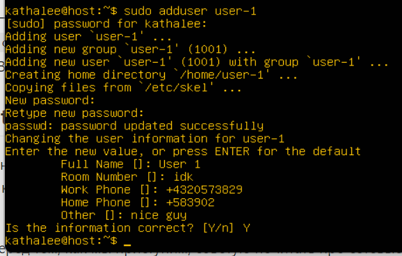

# Отчет

## PART 1: Установка ОС

- Скачала Virtual Box и iso **Ubuntu 20.04 Server LTS (**[https://ubuntu.com/download/server](https://ubuntu.com/download/server))
- вывод команды cat /etc/issue:


## PART 2: Создание пользователя

- создаю нового пользователя



- добавляю его в группу, которая называется adm


флаг a нужен для того, чтобы польхователь не удалялся из групп, не перечисленных после G, G нужен, чтобы списком группы перечислять, но это в целом не так обязательно

- выполняю команду cat /etc/passwd и чтобы не искать нового юзера грепаю его!
    
    
    
    тут не видно, что юзер в группе adm сидит, 
    
    на всякий случай проверяю это
    
    
    

## PART 3

- задаю название машины вида user-1, потом делаю sudo reboot, чтобы изменения вступили в силу
    
    
    
    сразу после ребута все выглядит вот так
    
    
    
- устанавливаю временную зону, соответствующую моему текущему местоположению. для этого сначала вывожу временную зону, которая у моего линукса
    
    
    
    затем смотрю все зоны командой timedatectl list-timezones, чтобы найти нужную — она называется Europe/Moscow
    
    
    
    задаю ее и проверяю успех:
    
    
    
- вывела названия сетевых интерфейсов с помощью ip link show
    
    
    
    еще для удобства (мб пригодится?) закачала net-tools, там лежит команда ifconfig, которая более наглядно все показывает
    
    
    
    enp0s3 — конфигурируемый сетевой инерфейс, в общем-то это про подключение компьютера к сети
    
    lo — loopback interface, он для коммуникации между процессами внутри одного устройства. адрес, который там указан (127.0.0.1) вне зависимости от устройства будет указывать на это же устройство
    
- получила ip адрес устройства, на котором работаю, от DHCP сервера


- определила и вывела на экран внешний ip-адрес шлюза (ip) и внутренний IP-адрес шлюза, он же ip-адрес по умолчанию (gw)
    
    
    
    - *U : This flag signifies that the route is up*
    - *G : This flag signifies that the route is to a gateway. If this flag is not present then we can say that the route is to a directly connected destination (Route is to a gateway router rather than to a directly connected network or host)*


- задала статичные (заданные вручную, а не полученные от DHCP сервера) настройки ip, gw, dns (использовать публичный DNS серверы, например 1.1.1.1 или 8.8.8.8)
    
    
    
    
    
    тут короче:
    dhcp4: false — отключаю динамические настройки
    addresses — ip адрес устройства — enp0s3
    /24 — маска сети 255.255.255.000
    gateway4 — ip адрес шлюза для подключения к внешней сети — тут могло бы быть 127.0.0.1 (что типа “это устройство”, lo), но в ВБ сетевые настройки заданы так, что 10.0.2.2 тоже работает как элиас 127.0.0.1
    nameservers — адреса серверов имен dns
    
    ```
    на самом деле с вб есть особые приколы по используемым элиасам, так, к
    к примеру:
    10.0.2.1    Router/gateway address
    10.0.2.2    Special alias to your host loopback interface (i.e., 127.0.0.1 on your development machine) -- именно его задаем как gateway4. мое наивное представление -- что машина хоста в данном случае выполняет роль маршрутизатора для удаленной машины
    10.0.2.3    First DNS server
    10.0.2.4 / 10.0.2.5 / 10.0.2.6  Optional second, third and fourth DNS server (if any)
    10.0.2.15   The emulated device's own network/ethernet interface
    127.0.0.1   The emulated device's own loopback interface
    ```
    
    
    
- перезагрузила виртуальную машину. убедилась , что статичные сетевые настройки (ip, gw, dns) соответствуют заданным в предыдущем пункте.
    
    
    
    
    
- Успешно пропинговала удаленные хосты 1.1.1.1 и [ya.ru](http://ya.ru/) и вставила в отчёт скрин с выводом команды. В выводе команды фраза "0% packet loss".
    
    
    

## **Part 4: Обновление ОС**

- смотрю, что можно наобновлять
    
    
    
    `sudo apt update`
    
    `sudo apt-get upgrade`
    
    как результат:
    
    
    
    и 
    
    
    

## ****Part 5: Использование команды sudo****


## **Part 6. Установка и настройка службы времени**


## **Part 7. Установка и использование текстовых редакторов**


- NANO
    - `nano test_NANO.txt`
        
        
        
    - записала “kathalee”, нажала ctrl+O, enter, ctrl+X
        
        
        
    - ctrl+\ → kathalee 21 enter → School 21 enter → Y (replace instance)
        
        
        
    - ctrl + X (потом N на save modified buffer) чтобы выйти без сохранения
        
        
        
    - поиск : ctrl + W, потом паттерн и энтер, чтобы повторять — просто ctrl+W и энтер
        
        
        
        замена вроде как двумя способами — ctrl + \ и ctrl+W ctrl+R (сначала ввести строку которую нужно заменить, потом строку, на которую заменяешь, потом можно уточнить, all occurences(A) или какие-то отдельные)
        
        
        
- VIM
    - `vim`
        
        
        
    - чтобы зайти в command mode, нажимаю esc
        
        
        
    - заменяю строку kathalee на 21 School 21 перейдя в command mode
        
        
        
    - выхожу без сохранения
        
        
        
    
    
    
    - перешла в insert mode (i), накатала чего-то, чтобы можно было искать, потом снова перешла в command mode, ввела /слово и энтер, чтобы перейти курсором
        
        
        
    - cw чтобы удалить слово и поставить курсор готовый писать. пишу, перехожу обратно в command mode
        
        
        
    - скрин про замену всех вхождений выше :)
- JOE
    - joe
    - ^K X , ввожу имя файла и сохраняю
        
        
        
    - чтобы выйти без сохранений, делаю ctrl+C (подтверждаю нажимая y)
        
        
        
    - ctrl K F для поиска по тексту
        
        
        
    - B, чтобы искал в обратную сторону (курсор стоит в конце текстового файла
        
        
        
    - меняем мартина на бобу — так же делаем поиск, только помимо B пишем R, чтобы заменить. после энтера вводим бобу
        
        
        
    - он предлагает менять первого мартина, потому что мы идем назад от начала последнего мартина
        
        
        
    - результат замены:
        
        
        

## Part 8. Установка и базовая настройка сервиса **SSHD**

- `sudo apt-get install openssh-server` — устанавливаю
    
    
    
- `sudo systemctl enable ssh` — автостарт при запуске
    
    
    
- конфигурация фаерволла ufw


- меняю порт 22 на 2022 в файле `sshd_config` : `sudo nano sshd_config` (он в /etc/ssh)


- рестарчу ssh чтобы изменения пришли в силу (`sudo service ssh restart`) и вывожу `netstat -tan`
    
    
    
    использованный протокол — очере — локальный адрес — удаленный адрес — внутреннее состояние протокола (тут LISTEN — ожидает входящих соединений)
    
    -t — только tcp порты
    
    -a — показать все сокеты, в тч используемые серверными процессами
    
    -n — показать адреса как числа, а не как символы (например 127.0.0.53 писался бы как localhost)
    
    0.0.0.0 — маршрут по умолчанию, на пк он показывается, если не подключены к сети tcp/ip, на серверах, обозначает все IPv4 — то есть в нетстате 0.0.0.0:* это любой IPv4 с любого порта (а ::::* — любой IPv6 с любого порта)
    
    в локальных адресах есть 2022 порт который мы ток что настроили и 53, который классический для TCP
    

## ****Part 9. Установка и использование утилит top, htop****

- top уже установлена, можно просто запускать
    
    
    | uptime | 4:01 (часы минуты) |
    | --- | --- |
    | количество авторизованных пользователей | 1 |
    | общая нагрузка системы | 1.09 от единственного ядра (!) за последнюю минуту, 1.03  за последние 5 минут, 1.01 за последние 15 |
    | число процессов | 113 всего, 2 сейчас работают |
    | загрузка cpu | 0.9 на систему, 99.1 на выполнение найсов (процессов с измененным приоритетом) — у джона найс 19 |
    | загрузка памяти | 201 мб использован |
    | pid процесса, занимающего больше всего памяти (сортировка по памяти — M) | 1273 (snapd, 1.9%) |
    | pid процесса, занимающего больше всего процессорного времени (R) | 1399 |
    
    
    
- HTOP
    - сортировка по PID (чтобы отсортировать зажимаю >)
        
        
        
    - сортировка по PERCENT_CPU
        
        
        
    - сортировка по PERCENT_MEM
        
        
        
    - сортировка по TIME
        
        
        
    - фильтр для sshd (\ для фильтра)
        
        
        
    - процесс syslog (/ чтобы поставить искать) — сначала показывает не syslog, поэтому жмем fn + F3 (обычно должно работать просто F3)
        
        
        
    - вывод hostname, clock, uptime — fn + F2
    
    
    

## ****Part 10. Использование утилиты fdisk****

- запускаем fdisk -l
    
    
    
    | название | VBOX HARDDISK |
    | --- | --- |
    | размер | 10.46 гб |
    | количество секторов | 21923584 |
    | размер swap | ?? |

## ****Part 11. Использование утилиты df****

- `df`
    
    
    |  |  | единицы измерения |
    | --- | --- | --- |
    | размер раздела | 8875924 | KB |
    | размер занятого пространства | 4488004 | KB |
    | размер свободного пространства | 3915448 | KB |
    | • процент использования | 54 |  |
    
    
    
- `df -Th`
    
    
    | размер раздела | 8.5 G |
    | --- | --- |
    | размер занятого пространства | 4.3 G |
    | размер свободного пространства | 3.8 G |
    | процент использования | 54% |
    
    
    
- тип файловой системы — ext4 — просто файловая система по умолчанию для убунты ([https://ru.wikipedia.org/wiki/Ext4](https://ru.wikipedia.org/wiki/Ext4))

## ****Part 12. Использование утилиты du****

- размер папок /home, /var, /var/log в байтах
    
    
    
- размер папок /home, /var, /var/log в человекочитаемом виде
    
    
    
- размер всего содержимого в /var/log
    
    `sudo du -h /var/log/* | less`
    
    
    
    
    

## ****Part 13. Установка и использование утилиты ncdu****

- `sudo apt-install ncdu`
- `ncdu`
    
    
    
    | /home | 440 kb |
    | --- | --- |
    | /var | 824.1 mb |
    
    
    
    | /var/log | 91.6 mb |
    | --- | --- |
    
    почти ничего не поменялось, кроме var — должно быть потому что мы только что установили ncdu))
    

## **Part 14. Работа с системными журналами**

- `cat /var/log/dmesg | less`
    
    
    
    драйвера устройств
    
- `cat /var/log/syslog | less`
    
    
    
    глобальный системный журнал, в котором пишутся сообщения с момента запуска системы, от ядра Linux, различных служб, обнаруженных устройствах, сетевых интерфейсов и много другого
    
- `cat /var/log/auth.log`
    
    
    
    грепаю “login”
    
    
    
     — последняя аутентификация
    
    можно удобнее смотреть командой last, она берет из лога `/etc/log/wtmp` и там показано, что вход через терминал tty1
    
    
    
- перезапускаю SSHd  (`sudo systemctl restart ssh.service`)
    
    
    
    лежит в `/var/log/auth.log`
    

## ****Part 15. Использование планировщика заданий CRON****

- `crontab -e` (выбираю 5ый эдитор, то есть нано)
- `минута час день месяц день_недели /путь/к/исполняемому/файлу` - > у нас будет */2 * * * * uptime
    
    
    
- строчки в журналах:
    
    
    
- текущий список (`crontab -l`)
    
    
    
- удаление (`crontab -r`) и текущий список:
    
    